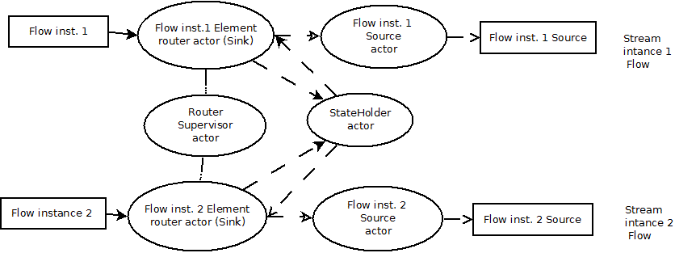

# Concurrent streams sharing the state demo

## Overview
This Akka demo based on Websocket server shows how multiple akka-streams can interact 
each other and share a common state if necessary. Here we have a web socket server that accepts connections and allows to manipulate a list of items, adding or removing them. Also a connected party can subscribe for events caused by other connected parties such as ItemAdded or ItemRemoved. 

Architecturally each socket connecion creates a stream instance that accepts json commands, parses them into messages and then sends them to the StateHolder actor for processing. The stream Flow is based on Sink and Source actors. The Sink actor acts as a router of elements sending them to StateHolder actor. Once the router gets the response from StateHolder, it passes them to Source actor for further handling. The diagram below briefly describes the process.

Also, the supervisor of routers sends notifications to those parties who subscribed for events.

StateHolder actor acts as a "synchronized block" for messages from multiple streams to process them sequentially.
##Testing
There are the two clients based on webSocketClientFlow. 

The first one, WSClientFlowEntry, subscribes for events, then adds the first half of elements, then unsubscribes following addition of the second half of elements. In case the two instances being run simultaneously, first they get notifications from each other, but after unsibscribing they receive only their own responses.

The second client, WSMultipleClientEntry, creates multiple parallel websocket clients each of those first adds and then removes the numerous number of items. As a result, once all the clients are done, the list of items should be empty.
## License
This source code is made available under the [Apache 2.0 License](http://www.apache.org/licenses/LICENSE-2.0)
